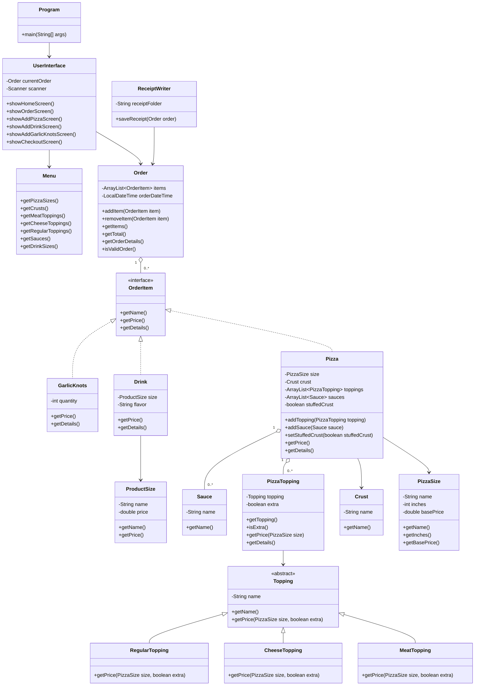

```mermaid
classDiagram

class Program {
  +main(String[] args)
}

class UserInterface {
  -Order currentOrder
  -Scanner scanner
  +showHomeScreen()
  +showOrderScreen()
  +showAddPizzaScreen()
  +showAddDrinkScreen()
  +showAddGarlicKnotsScreen()
  +showCheckoutScreen()
}

class Order {
  -ArrayList~OrderItem~ items
  -LocalDateTime orderDateTime
  +addItem(OrderItem item)
  +removeItem(OrderItem item)
  +getItems()
  +getTotal()
  +getOrderDetails()
  +isValidOrder()
}

class OrderItem {
  <<interface>>
  +getName()
  +getPrice()
  +getDetails()
}

class Pizza {
  -PizzaSize size
  -Crust crust
  -ArrayList~PizzaTopping~ toppings
  -ArrayList~Sauce~ sauces
  -boolean stuffedCrust
  +addTopping(PizzaTopping topping)
  +addSauce(Sauce sauce)
  +setStuffedCrust(boolean stuffedCrust)
  +getPrice()
  +getDetails()
}

class Drink {
  -ProductSize size
  -String flavor
  +getPrice()
  +getDetails()
}

class GarlicKnots {
  -int quantity
  +getPrice()
  +getDetails()
}

class PizzaSize {
  -String name
  -int inches
  -double basePrice
  +getName()
  +getInches()
  +getBasePrice()
}

class ProductSize {
  -String name
  -double price
  +getName()
  +getPrice()
}

class Crust {
  -String name
  +getName()
}

class Topping {
  <<abstract>>
  -String name
  +getName()
  +getPrice(PizzaSize size, boolean extra)
}

class MeatTopping {
  +getPrice(PizzaSize size, boolean extra)
}

class CheeseTopping {
  +getPrice(PizzaSize size, boolean extra)
}

class RegularTopping {
  +getPrice(PizzaSize size, boolean extra)
}

class PizzaTopping {
  -Topping topping
  -boolean extra
  +getTopping()
  +isExtra()
  +getPrice(PizzaSize size)
  +getDetails()
}

class Sauce {
  -String name
  +getName()
}

class ReceiptWriter {
  -String receiptFolder
  +saveReceipt(Order order)
}

class Menu {
  +getPizzaSizes()
  +getCrusts()
  +getMeatToppings()
  +getCheeseToppings()
  +getRegularToppings()
  +getSauces()
  +getDrinkSizes()
}

Program --> UserInterface
UserInterface --> Order
UserInterface --> Menu
Order "1" o-- "0..*" OrderItem
OrderItem <|.. Pizza
OrderItem <|.. Drink
OrderItem <|.. GarlicKnots
Pizza --> PizzaSize
Pizza --> Crust
Pizza "1" o-- "0..*" PizzaTopping
Pizza "1" o-- "0..*" Sauce
PizzaTopping --> Topping
Topping <|-- MeatTopping
Topping <|-- CheeseTopping
Topping <|-- RegularTopping
Drink --> ProductSize
ReceiptWriter --> Order
```