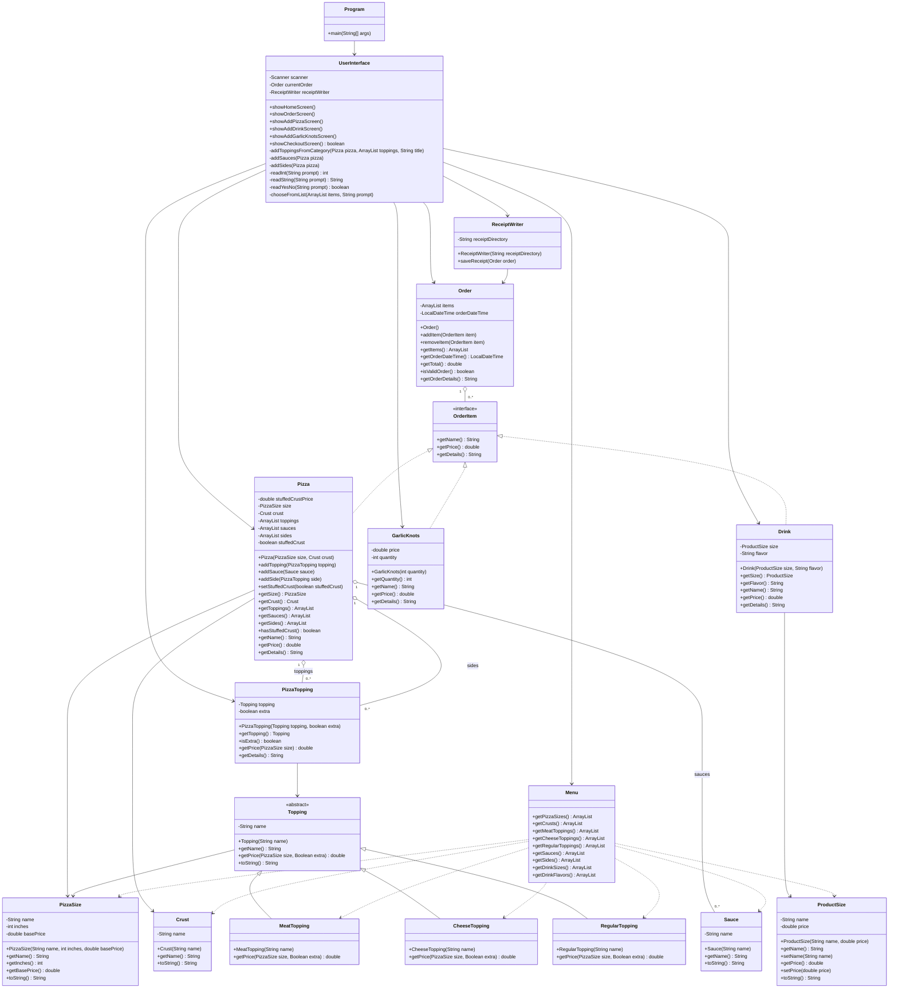

```mermaid
classDiagram

    class Program {
        +main(String[] args)
    }

    class UserInterface {
        -Scanner scanner
        -Order currentOrder
        -ReceiptWriter receiptWriter
        +showHomeScreen()
        +showOrderScreen()
        +showAddPizzaScreen()
        +showAddDrinkScreen()
        +showAddGarlicKnotsScreen()
        +showCheckoutScreen() boolean
        -addToppingsFromCategory(Pizza pizza, ArrayList toppings, String title)
        -addSauces(Pizza pizza)
        -addSides(Pizza pizza)
        -readInt(String prompt) int
        -readString(String prompt) String
        -readYesNo(String prompt) boolean
        -chooseFromList(ArrayList items, String prompt)
    }

    class Menu {
        +getPizzaSizes() ArrayList
        +getCrusts() ArrayList
        +getMeatToppings() ArrayList
        +getCheeseToppings() ArrayList
        +getRegularToppings() ArrayList
        +getSauces() ArrayList
        +getSides() ArrayList
        +getDrinkSizes() ArrayList
        +getDrinkFlavors() ArrayList
    }

    class ReceiptWriter {
        -String receiptDirectory
        +ReceiptWriter(String receiptDirectory)
        +saveReceipt(Order order)
    }

    class Order {
        -ArrayList items
        -LocalDateTime orderDateTime
        +Order()
        +addItem(OrderItem item)
        +removeItem(OrderItem item)
        +getItems() ArrayList
        +getOrderDateTime() LocalDateTime
        +getTotal() double
        +isValidOrder() boolean
        +getOrderDetails() String
    }

    class OrderItem {
        <<interface>>
        +getName() String
        +getPrice() double
        +getDetails() String
    }

    class Pizza {
        -double stuffedCrustPrice
        -PizzaSize size
        -Crust crust
        -ArrayList toppings
        -ArrayList sauces
        -ArrayList sides
        -boolean stuffedCrust
        +Pizza(PizzaSize size, Crust crust)
        +addTopping(PizzaTopping topping)
        +addSauce(Sauce sauce)
        +addSide(PizzaTopping side)
        +setStuffedCrust(boolean stuffedCrust)
        +getSize() PizzaSize
        +getCrust() Crust
        +getToppings() ArrayList
        +getSauces() ArrayList
        +getSides() ArrayList
        +hasStuffedCrust() boolean
        +getName() String
        +getPrice() double
        +getDetails() String
    }

    class Drink {
        -ProductSize size
        -String flavor
        +Drink(ProductSize size, String flavor)
        +getSize() ProductSize
        +getFlavor() String
        +getName() String
        +getPrice() double
        +getDetails() String
    }

    class GarlicKnots {
        -double price
        -int quantity
        +GarlicKnots(int quantity)
        +getQuantity() int
        +getName() String
        +getPrice() double
        +getDetails() String
    }

    class PizzaSize {
        -String name
        -int inches
        -double basePrice
        +PizzaSize(String name, int inches, double basePrice)
        +getName() String
        +getInches() int
        +getBasePrice() double
        +toString() String
    }

    class ProductSize {
        -String name
        -double price
        +ProductSize(String name, double price)
        +getName() String
        +setName(String name)
        +getPrice() double
        +setPrice(double price)
        +toString() String
    }

    class Crust {
        -String name
        +Crust(String name)
        +getName() String
        +toString() String
    }

    class Sauce {
        -String name
        +Sauce(String name)
        +getName() String
        +toString() String
    }

    class PizzaTopping {
        -Topping topping
        -boolean extra
        +PizzaTopping(Topping topping, boolean extra)
        +getTopping() Topping
        +isExtra() boolean
        +getPrice(PizzaSize size) double
        +getDetails() String
    }

    class Topping {
        <<abstract>>
        -String name
        +Topping(String name)
        +getName() String
        +getPrice(PizzaSize size, Boolean extra) double
        +toString() String
    }

    class MeatTopping {
        +MeatTopping(String name)
        +getPrice(PizzaSize size, Boolean extra) double
    }

    class CheeseTopping {
        +CheeseTopping(String name)
        +getPrice(PizzaSize size, Boolean extra) double
    }

    class RegularTopping {
        +RegularTopping(String name)
        +getPrice(PizzaSize size, Boolean extra) double
    }

    Program --> UserInterface
    UserInterface --> Order
    UserInterface --> ReceiptWriter
    UserInterface --> Menu
    UserInterface --> Pizza
    UserInterface --> Drink
    UserInterface --> GarlicKnots
    UserInterface --> PizzaTopping

    ReceiptWriter --> Order

Order "1" o-- "0..*" OrderItem

OrderItem <|.. Pizza
OrderItem <|.. Drink
OrderItem <|.. GarlicKnots

Pizza --> PizzaSize
Pizza --> Crust
Pizza "1" o-- "0..*" PizzaTopping : toppings
Pizza "1" o-- "0..*" Sauce : sauces
Pizza "1" o-- "0..*" PizzaTopping : sides

PizzaTopping --> Topping
Topping <|-- MeatTopping
Topping <|-- CheeseTopping
Topping <|-- RegularTopping
Topping --> PizzaSize

Drink --> ProductSize

Menu ..> PizzaSize
Menu ..> Crust
Menu ..> Sauce
Menu ..> ProductSize
Menu ..> MeatTopping
Menu ..> CheeseTopping
Menu ..> RegularTopping
```