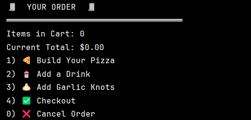
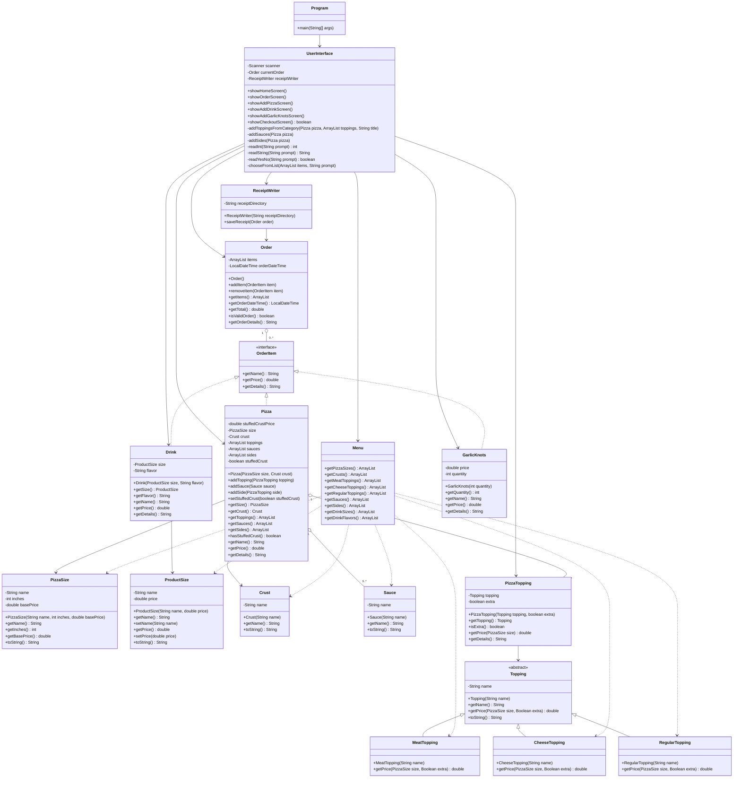

# Pizza World

Pizza World is a Java console point-of-sale application for a custom pizza shop. The application allows customers to create a new order, customize pizzas, add drinks, add garlic knots, review the order, and save a receipt when checkout is confirmed.


---

## Project Description

Pizza World helps automate the ordering process for a custom pizza shop. Customers can build pizzas by choosing a size, crust, toppings, sauces, sides, and stuffed crust. They can also add drinks and garlic knots to the order.

When the customer checks out, the application displays the full order details and total price. If the order is confirmed, a receipt file is created in the `receipts` folder using the order date and time.

Receipt filename format:

```text
yyyyMMdd-HHmmss.txt
```

Example:

```text
20230329-121523.txt
```

---

## Features

- Start a new order
- Cancel an order
- Add customized pizzas
- Choose pizza size:
    - Personal 8"
    - Medium 12"
    - Large 16"
- Choose crust:
    - Thin
    - Regular
    - Thick
    - Cauliflower
- Add meat toppings
- Add cheese toppings
- Add regular toppings
- Add sauces
- Add sides:
    - Red Pepper
    - Parmesan
- Choose extra toppings
- Add stuffed crust
- Add drinks by size and flavor
- Add garlic knots
- Display full order details at checkout
- Display total order price
- Save receipts to a `receipts` folder
- Store newest order items first

---

## Project Structure

```text
pizza-world/
│
├── Diagrams/
│   └── Diagram.md
│
├── receipts/
│
├── src/
│   └── main/
│       └── java/
│           └── com/
│               └── pizzaworld/
│                   ├── Program.java
│                   │
│                   ├── data/
│                   │   └── Menu.java
│                   │
│                   ├── models/
│                   │   ├── Crust.java
│                   │   ├── Drink.java
│                   │   ├── GarlicKnots.java
│                   │   ├── Order.java
│                   │   ├── OrderItem.java
│                   │   ├── Pizza.java
│                   │   ├── PizzaSize.java
│                   │   ├── PizzaTopping.java
│                   │   ├── ProductSize.java
│                   │   ├── Sauce.java
│                   │   └──toppings/
│                   │       ├── CheeseTopping.java
│                   │       ├── MeatTopping.java
│                   │       ├── RegularTopping.java
│                   │       └── Topping.java
│                   │
│                   ├── services/
│                   │   └── ReceiptWriter.java
│                   │
│                   │
│                   └── ui/
│                       └── UserInterface.java
│
├── .gitignore
├── pom.xml
└── README.md
```

---

## Main Screens

### Home Screen

The home screen allows the user to:

```text
1) Start a Fresh Order
0) Exit
```


### Order Screen

The order screen allows the user to:

```text
1) Build Your Pizza
2) Add a Drink
3) Add Garlic Knots
4) Checkout
0) Cancel Order
```

### Add Pizza Screen

The pizza screen walks the customer through:

```text
Pizza size
Crust style
Meat toppings
Cheese toppings
Regular toppings
Sauces
Sides
Stuffed crust
```

### Checkout Screen

The checkout screen displays:

```text
Order details
Pizza customization
Drink details
Garlic knots
Total price
Confirm or cancel options
```

## Class Diagram



---

## Receipt Example

```text
PIZZA WORLD Receipt
═══════════════════════════════════════════════
Order Time: 2026-05-28T14:30:15

Item 1:
Medium pizza base: $12.00
Crust: Regular
Meats:
 Pepperoni               $ 2.00
Meat total: $ 2.00
Cheeses:
 Extra Mozzarella        $ 2.10
Cheese total: $ 2.10
Regular toppings:
 Onions                  $ 0.00
Regular toppings total: $ 0.00
Sauces:
 Marinara                $ 0.00
Sauces total: $ 0.00
Stuffed crust: $ 2.00
Sides:
 Red Pepper              $ 0.00
Sides total: $ 0.00
--------------------------------
Total: $18.10

Total: $18.10
```